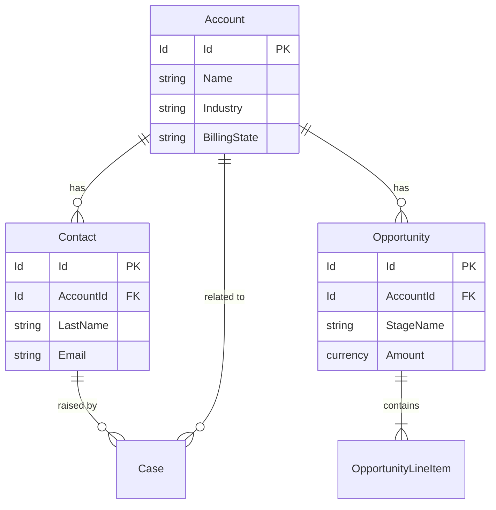
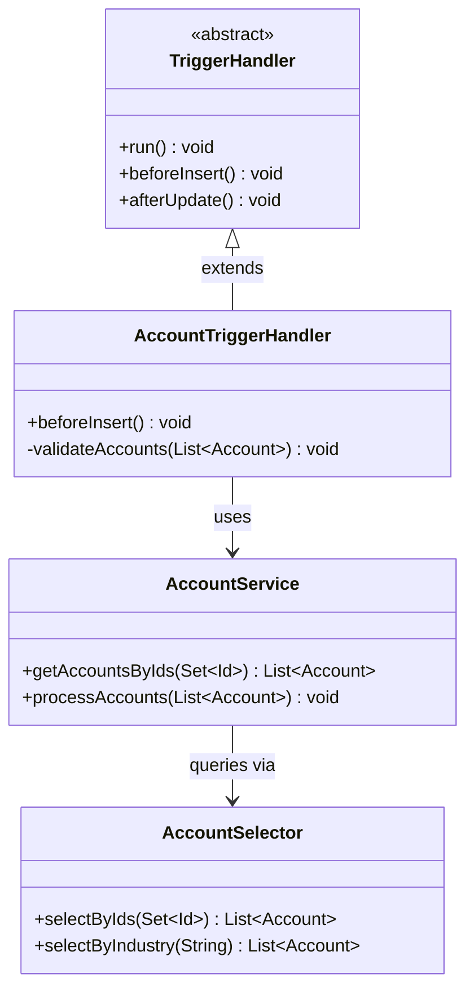
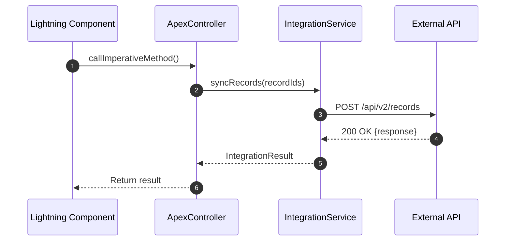
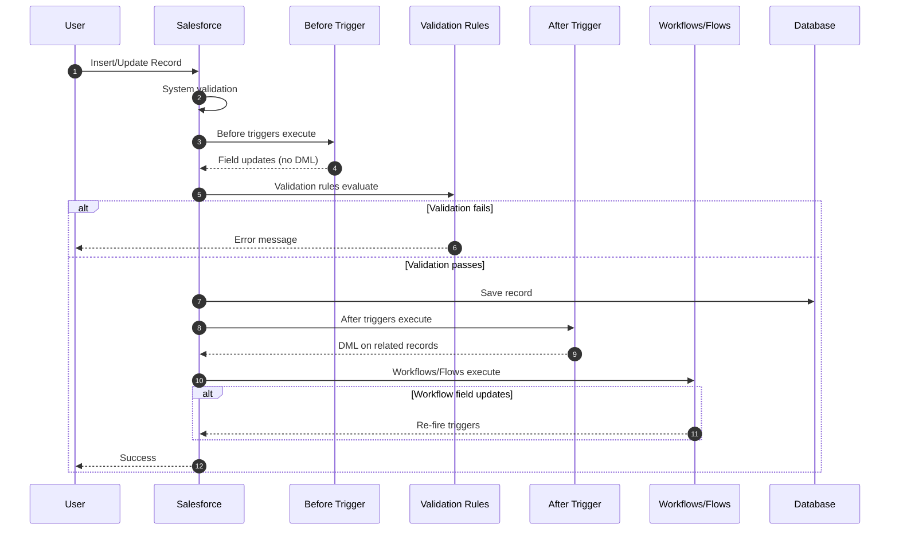
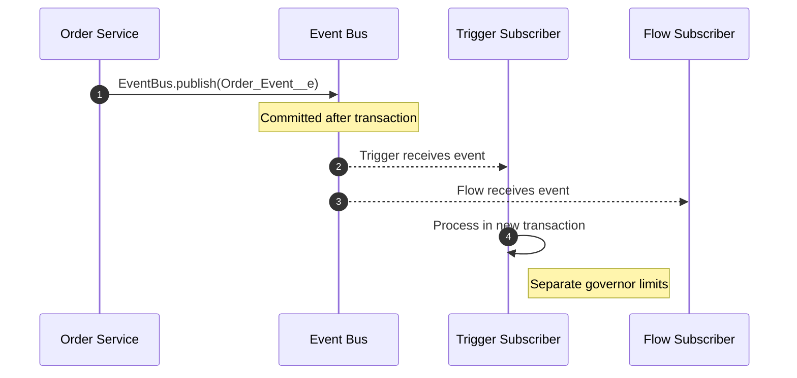
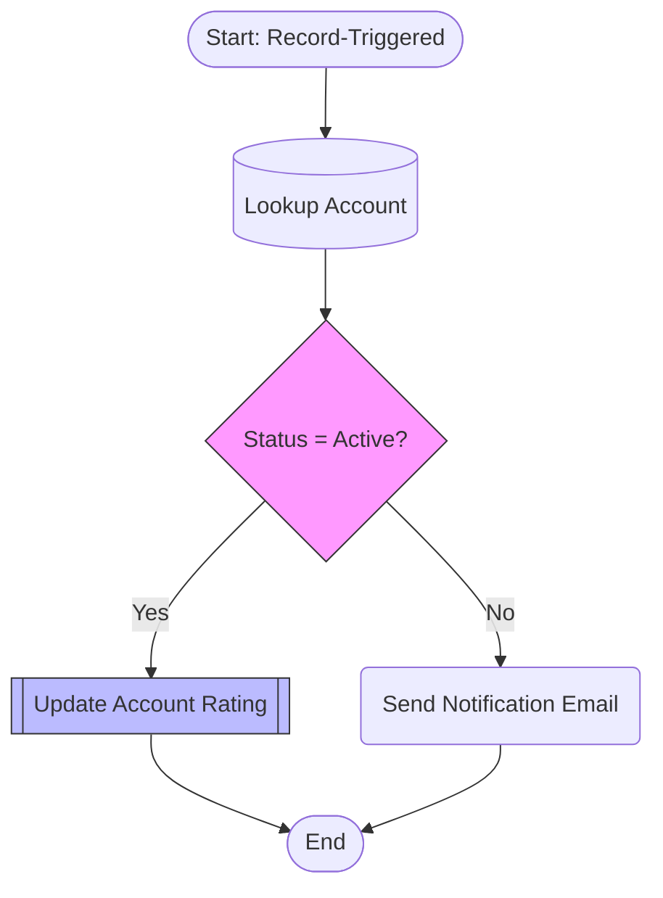
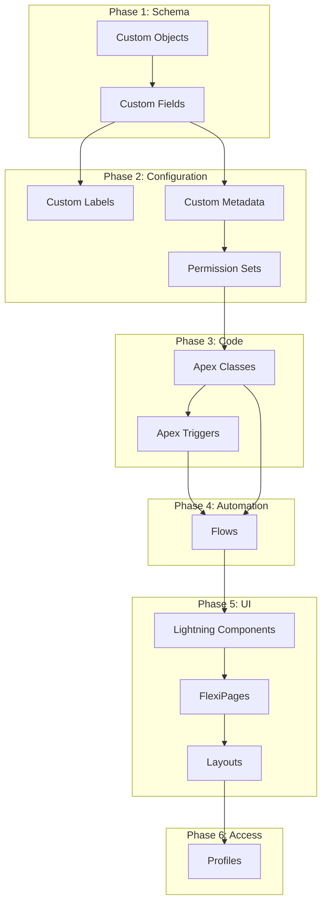

# Salesforce Diagram Generator

Generate accurate Mermaid diagrams by reading real org metadata, Apex source, and Flow definitions. Every diagram must be grounded in actual project files when available.

## 1. Entity Relationship Diagrams (ERDs)

Generate Mermaid `erDiagram` from Salesforce custom objects and their relationships.

### How to Build an ERD

1. **Find object metadata**:
   ```
   force-app/**/objects/**/*.object-meta.xml
   ```

2. **Find field metadata**:
   ```
   force-app/**/objects/*/fields/*.field-meta.xml
   ```

3. **Identify relationships** — Read each field file and look for:
   - `<type>Lookup</type>` — optional relationship
   - `<type>MasterDetail</type>` — required relationship (cascade delete)
   - `<referenceTo>ObjectName</referenceTo>` — the related object

4. **Render as erDiagram**:



### Relationship Notation

| Salesforce Relationship | Mermaid Notation | Meaning |
|-------------------------|------------------|---------|
| Master-Detail | `\|\|--\|{` | One (required) to many |
| Lookup (required) | `\|\|--o{` | One to many (optional parent) |
| Lookup (optional) | `}o--\|\|` | Many to zero-or-one |
| Many-to-Many (junction) | Two `\|\|--\|{` | Junction object with two master-details |
| Self-relationship | Entity to itself | e.g., Account hierarchy |

### ERD Filtering Rules
- **Include**: Custom objects (`__c`), standard objects referenced by custom fields
- **Exclude**: System audit fields, metadata objects, setup objects
- **Field display**: Show only key fields (Id, Name, foreign keys, up to 5 domain fields)
- **Size limit**: Cap at ~30 objects per diagram — split large models into functional domains

## 2. Class Diagrams

Generate Mermaid `classDiagram` from Apex source files.

### How to Build a Class Diagram

1. **Find Apex classes**:
   ```
   force-app/**/classes/*.cls
   ```

2. **Parse each class** — Identify:
   - Class declaration: `public class`, `public abstract class`, `public virtual class`
   - Interfaces: `implements SomeInterface`
   - Inheritance: `extends ParentClass`
   - Key methods: `public`, `@AuraEnabled`, `@InvocableMethod`, `@HttpGet`
   - Dependencies: other classes referenced in the body

3. **Render as classDiagram**:



### Class Stereotypes

| Apex Pattern | Mermaid Stereotype |
|-------------|-------------------|
| Interface | `<<interface>>` |
| Abstract class | `<<abstract>>` |
| Batch class | `<<batch>>` |
| Queueable | `<<queueable>>` |
| Schedulable | `<<schedulable>>` |
| REST resource | `<<restresource>>` |
| Test class | `<<test>>` |
| Trigger handler | `<<handler>>` |

### Visibility Markers
- `+` public
- `-` private
- `#` protected
- `~` internal (default/package)

## 3. Sequence Diagrams

Generate Mermaid `sequenceDiagram` for integration flows, trigger execution, and async processing.

### REST Callout Sequence



### Trigger Execution Order



### Platform Event Pub/Sub



### Building from Code
1. **Identify the flow** — Ask the user or infer from the entry point
2. **Trace the call chain** — Read each class, follow method calls
3. **Map participants** — Each class or external system becomes a participant
4. **Capture request/response** — Solid arrows for calls, dashed for returns
5. **Add notes** — Mark async boundaries, governor limit resets, transaction boundaries

## 4. Flow Diagrams

Convert Salesforce Flow XML (`.flow-meta.xml`) to Mermaid flowcharts.

### Flow Element to Mermaid Shape Mapping

| Flow Element | XML Tag | Mermaid Shape |
|-------------|---------|---------------|
| Screen | `<screens>` | `[/ Screen Name /]` (parallelogram) |
| Decision | `<decisions>` | `{ Decision Label }` (diamond) |
| Assignment | `<assignments>` | `[ Assignment Label ]` (rectangle) |
| Record Lookup | `<recordLookups>` | `[( SOQL Query )]` (stadium) |
| Record Create | `<recordCreates>` | `[[ Insert Record ]]` (subroutine) |
| Record Update | `<recordUpdates>` | `[[ Update Record ]]` (subroutine) |
| Record Delete | `<recordDeletes>` | `[[ Delete Record ]]` (subroutine) |
| Subflow | `<subflows>` | `[[ Subflow Name ]]` (subroutine) |
| Action | `<actionCalls>` | `( Action Label )` (rounded) |
| Loop | `<loops>` | `{ Loop Variable }` (diamond) |
| Start | `<start>` | `([ Start ])` (stadium) |

### Example Flow Diagram



### Flow Diagram Rules
- Always show Start and End nodes
- Label decision branches with the outcome name
- Show fault connectors as dashed lines when present
- Group loops visually — show the loop node and its body
- For large Flows (20+ elements), show summary first, then offer detail

## 5. Deployment Dependency Diagrams

Show metadata deployment order as a directed acyclic graph.

### Standard Deployment Order



### Building Dependency Graphs

1. **Scan the project**: `force-app/main/default/**/*-meta.xml`
2. **Map dependencies**: Objects → Fields → Classes → Triggers → LWC → Flows → Permissions
3. **Identify cross-references**: Read class files for object/field references
4. **Render with proper grouping**

## 6. When to Split Diagrams

Large diagrams become unreadable. Use these rules:

| Diagram Type | Maximum | How to Split |
|-------------|---------|--------------|
| ERD | ~30 objects | Split by domain (Sales, Service, Custom) |
| Class Diagram | ~15 classes | Split by layer (Service, Selector, Handler) |
| Sequence Diagram | ~20 steps | Split by phase (Auth, Process, Response) |
| Flowchart | ~25 nodes | Split by functional area |
| Dependency Graph | ~40 nodes | Split by metadata type or package |

**💡 Junior Developer Tip:** If the diagram doesn't fit on one screen, it's probably too big. Offer a high-level summary diagram first, then detailed sub-diagrams.

## 7. Mermaid Syntax Quick Reference

### Diagram Types for Salesforce

| Salesforce Use Case | Mermaid Type | Declaration |
|--------------------|-------------|-------------|
| Object relationships | `erDiagram` | `erDiagram` |
| Apex class structure | `classDiagram` | `classDiagram` |
| Integration flows | `sequenceDiagram` | `sequenceDiagram` |
| Flow visualization | `flowchart` | `flowchart TD` or `flowchart LR` |
| Deployment order | `flowchart` | `flowchart LR` |
| Timeline / releases | `gantt` | `gantt` |
| State machine | `stateDiagram-v2` | `stateDiagram-v2` |

### Directions
- `TD` (top-down) — best for flows and processes
- `LR` (left-right) — best for ERDs and dependencies
- `RL` (right-left) — rarely used
- `BT` (bottom-top) — rarely used

### Node Shapes
- `[Rectangle]` — process/action
- `(Rounded)` — action/call
- `{Diamond}` — decision
- `[(Cylinder)]` — database
- `([Stadium])` — start/end
- `[[Subroutine]]` — DML/subflow
- `[/Parallelogram/]` — screen/input
- `((Circle))` — connector

### Link Types
- `-->` — solid arrow (normal flow)
- `-.->` — dashed arrow (async/fault path)
- `==>` — thick arrow (critical path)
- `-->|label|` — labeled arrow

## 8. Gotchas and Common Mistakes

### Mermaid Renderer Limitations

| Issue | What Happens | Fix |
|-------|--------------|-----|
| Node limit (~100) | Diagram won't render | Split into sub-diagrams |
| Long labels (40+ chars) | Layout breaks | Abbreviate, use shorter names |
| Special characters | Syntax error | Wrap labels in quotes `"Label: Value"` |
| Generics `<>` in class diagrams | Syntax error | Use `~` instead: `List~Account~` |
| Colons in labels | Syntax error | Wrap in quotes |
| Parentheses in labels | May cause parsing issues | Escape or wrap in quotes |

### Platform-Specific Rendering

| Platform | Notes |
|----------|-------|
| GitHub | Renders Mermaid natively in `.md` files — test here |
| VS Code | Use "Markdown Preview Mermaid Support" extension |
| Confluence | Requires Mermaid plugin — check availability |
| Jira | Requires Mermaid plugin — check availability |
| Slack | Does not render — share as image |

### Salesforce-Specific Pitfalls

| Issue | Problem | Solution |
|-------|---------|----------|
| Polymorphic lookups (WhoId, WhatId) | Can't represent single relationship | Show as note or multiple optional links |
| Record Types | Not relationships | Show as attributes or stereotypes, not entities |
| Managed package objects | Namespace prefixes | Include prefix: `ns__Object__c` |
| Person Accounts | Merge Account and Contact | Note in diagram if enabled |
| External Objects (`__x`) | Connect via external lookup | Show with different style |
| Big Objects (`__b`) | Async insert only | Annotate if included |
| Junction objects | Two master-detail relationships | Render as entity, not direct many-to-many line |

## 9. Diagram Generation Checklist

Use this checklist before finalizing any diagram:

### General
- [ ] Diagram type matches the use case (ERD for data, sequence for flows, etc.)
- [ ] Diagram is grounded in actual metadata/code (not fabricated)
- [ ] Labels are accurate API names or clear display names
- [ ] Diagram renders without errors
- [ ] Fits on one screen (or split appropriately)
- [ ] Notes section explains assumptions and simplifications

### ERD Specific
- [ ] Cardinality is correct for all relationships
- [ ] Master-detail vs lookup distinguished properly
- [ ] Only key fields shown (not all 50+ fields)
- [ ] Standard objects included only if relevant

### Class Diagram Specific
- [ ] Correct stereotypes (`<<interface>>`, `<<abstract>>`, `<<handler>>`)
- [ ] Visibility markers used (`+` public, `-` private, `#` protected)
- [ ] Inheritance and implementation relationships shown correctly
- [ ] Dependencies shown with correct arrow type

### Sequence Diagram Specific
- [ ] Transaction boundaries marked
- [ ] Async boundaries noted
- [ ] Governor limit reset points shown (for complex flows)
- [ ] Error paths included where relevant

### Deployment Diagram Specific
- [ ] Dependency order is correct
- [ ] Cross-dependencies identified
- [ ] Phased grouping makes sense

## Workflow Summary

1. **Identify diagram type** from user request
2. **Read relevant metadata** files from the project
3. **Parse relationships**, dependencies, or call chains
4. **Check size** — split if too large
5. **Generate valid Mermaid** syntax
6. **Test render** before finalizing
7. **Add notes** section explaining key assumptions
8. **Offer formats** — inline, `.md` file, or ASCII for terminals

## Tips for Junior Developers

| Diagram Type | When to Create | What It Shows |
|-------------|----------------|---------------|
| **ERD** | Before writing code | Data model, relationships, field types |
| **Class Diagram** | Code reviews, onboarding | Code structure, dependencies, patterns |
| **Sequence Diagram** | Integration docs, debugging | Who calls who, in what order |
| **Flow Diagram** | Flow reviews, deployment | Automation logic, decision paths |
| **Dependency Diagram** | Before deployment | What deploys first, avoiding failures |

**Start simple.** Create a small diagram for one area first. Expand only if needed.

**Ask questions.** If you're not sure what the relationship type is (lookup vs master-detail), check the field metadata before diagramming.

**Iterate.** Diagrams are documentation — they should evolve as the code evolves.